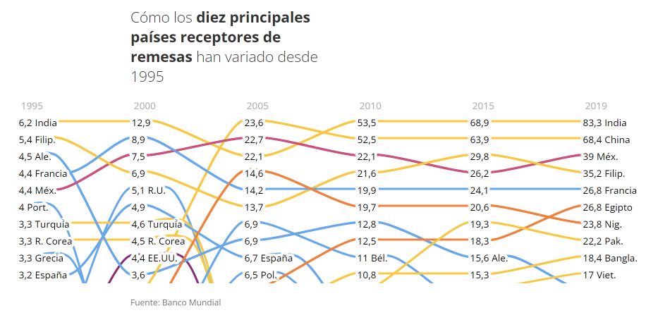
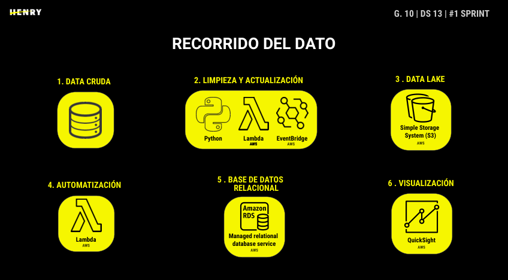
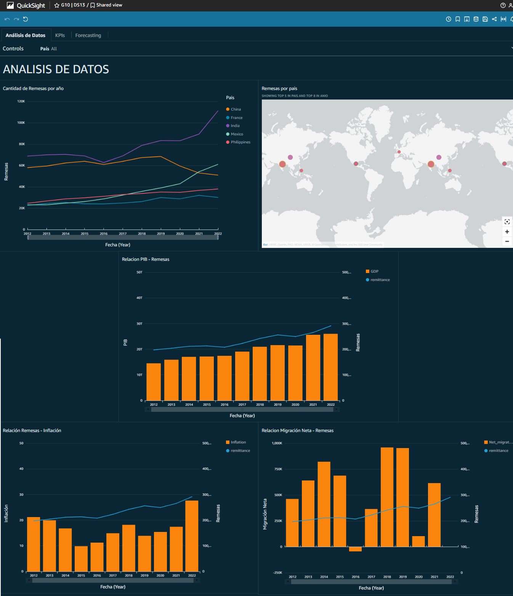
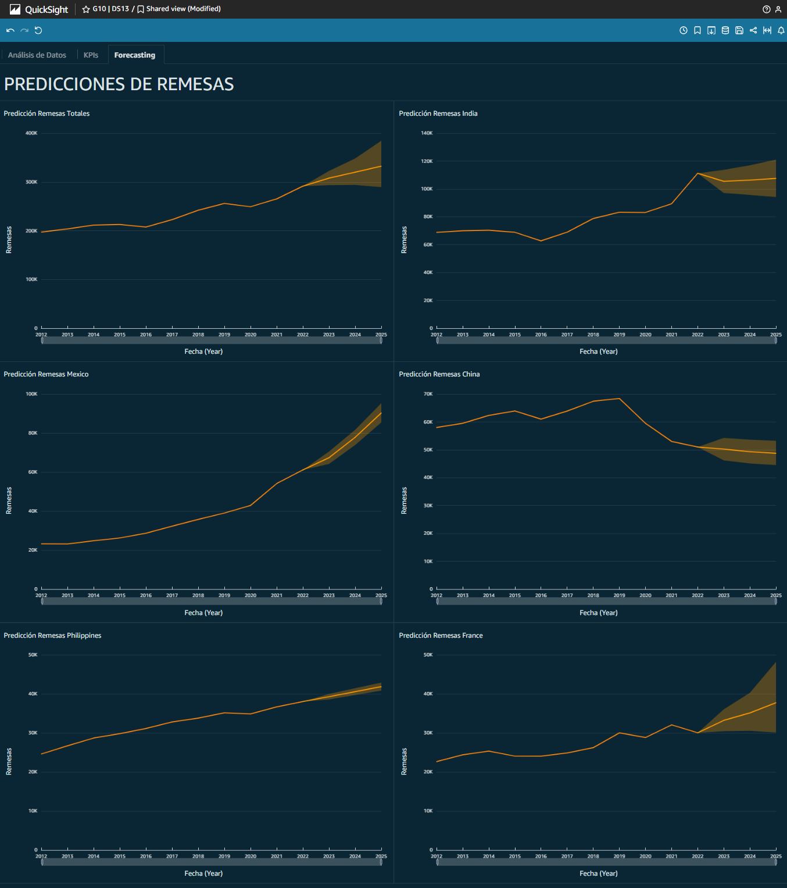

# Proyecto Final Henry - Flujos Migratorios

## Grupo 10:
- ### [Laura Lozano](https://github.com/LLozanoBaron)
- ### [Guillermo Jara](https://github.com/GLJaraBarth)
- ### [Pablo Santisteban](https://github.com/polsantis)
- ### [Cristian Torres](https://github.com/cristian-torres-ds)

## Contexto

Fenómenos como la migración, traen consigo transformaciones sociales y económicas a nivel mundial. Comprendiendo los cambios de escala, las tendencias emergentes y la evolución de las variables demográficas, entenderemos mejor los cambios del mundo en que vivimos y podremos planificar mejor el futuro.
Entre 1990 y 2020, el número estimado de migrantes ha aumentado de 128 millones a 281 millones en estas tres décadas.
Las principales regiones que se destacan en acoger migrantes son Europa, Asia y América del Norte.
Entre muchas otras cosas, los datos existentes indican un aumento global de las remesas en los últimos decenios. 
Las remesas son transferencias de dinero o en especie que los migrantes hacen directamente a sus familias o comunidades en los países de origen.
Por todo esto, nuestro Cliente, nos encomendó realizar un análisis pormenorizado de este fenómeno y del mercado del negocio de envío internacional de dinero.

### **[Video Promocional](https://www.youtube.com/watch?v=vB51LimDHIw)**

 

## Objetivos

-	Analizar los flujos migratorios actuales para identificar nuevos actores.
-	Predecir flujos migratorios con la intención de identificar nuevos actores. 
-	Analizar el negocio del movimiento de remesas, principalmente del top 5 de países receptores, y como se ve afectado por variables macroeconómicas.
-	Identificar los países más rentables como así también los potenciales para el negocio.

## Alcance

El proyecto será limitado al top 5 de países receptores de remesas y su desarrollo en los últimos 10 años, pudiéndose incorporar al análisis algún país que surja como nuevo actor como resultado del análisis de los flujos migratorios, y tomando solo en consideración las variables macroeconómicas.
Dejaremos fuera del alcance otras razones que produzcan flujos migratorios, como ser conflictos bélicos, desastres naturales, etc.
Estas otras razones, como hacerlo extensivo a un mayor número de países, podría ser parte de la continuidad del proyecto de acuerdo con sus resultados.

## Metodologías:
- Scrum Diario: División de tareas y seguimiento.
- Daily Meeting Mentor: Follow up, avances y dudas.

## Herramientas
- Slack
- Ganttpro
- Google: Drive, Meets, Calendar.

## Stack Tecnológico
- Python
- MySQL
- AWS Suite:
    - IAM
    - Lambda
    - Amazon EventBridge
    - Amazon S3 (Simple Storage System)
    - EC2
    - Amazon Rds (Managed Relational Database Service)
    - Amazon QuickSight

## Fuentes de Datos

- [Banco Mundial](https://datos.bancomundial.org/)
- [Knomad.org](https://www.knomad.org/)
- [Organization for Economic Co-operation and Development](https://www.oecd.org/)

## Data Sets:

- Inflación países
- Migración Neta
- PIB Países
- Inward Remittance Flows
- Outward Remittance Flows

## Key Performance Indicators (KPIs)

- Tasa Anual de Remesas TAR (%) = ((Volumen U$S Año[1] - Volumen U$S Año[0])/ Volumen U$S Año[1]) x 100

Mide la variación año a año de las remesas recibidas por un país. Este KPI nos permite identificar como es el crecimiento, como así también su pendiente.

- Remesa Per Cápita RPC (U$S) = Volumen U$S Año/N° de Emigrantes Año

Muestra el promedio anual de la remesa por nuevo emigrante de un país.

- Índice de Variación de Remesa por Tasa Inflacionaria IVRTI (U$S/%) = Volumen U$S Año/% Inflación Anual

Muestra variaciones en el volumen de las remesas hacia un país por su porcentual de inflación.

- Índice de Variación de Remesa por PBI IVR-PBI (%) = (Volumen U$S Año/PBI) x 100

Muestra variaciones de el volumen de las remesas hacia un país respecto a su PBI.

## Recorrido de los datos

Amazon [Event Bridge](https://aws.amazon.com/es/eventbridge/) se encarga de activar periódica y automáticamente un pipeline, comenzando por unas funciones [Amazon Lambda](https://aws.amazon.com/es/lambda/).

Estas funciones Lambda escritas en python corren en una Máquina Virtual [Amazon EC2](https://aws.amazon.com/es/ec2/), y se encargan de descargar los Data Sets a usar, chequear actualizaciones, almacenarlos en un Data Lake [Amazon S3](https://aws.amazon.com/es/s3/), realizar transformaciones y finalmente cargarlos a un Data Warehouse [Amazon RDS](https://aws.amazon.com/es/rds/) (MySQL).

Se puede observar la automatización del proceso en este [VIDEO](https://youtu.be/9mpBlvI8HgI).

Luego hacemos uso de [Amazon Quicksight](https://aws.amazon.com/es/quicksight/) para generar un dashboard y poder analizar los datos.

Finalmente volvemos a hacer uso de Quicksight para realizar un modelo de ML (Machine Learning) de forecasting.

Usamos un algoritmo de predicción llamado BIFOCAL (CALibrated BI-FOrest architecture), genera dos árboles RCF (Random Cut Forest).

El primero es un árbol bien generalizado con una predicción pobre para filtrar anomalías, que se corrige con el segundo árbol que es más preciso.

Este método de forecasting es más robusto que los métodos usados comunmente.

 

